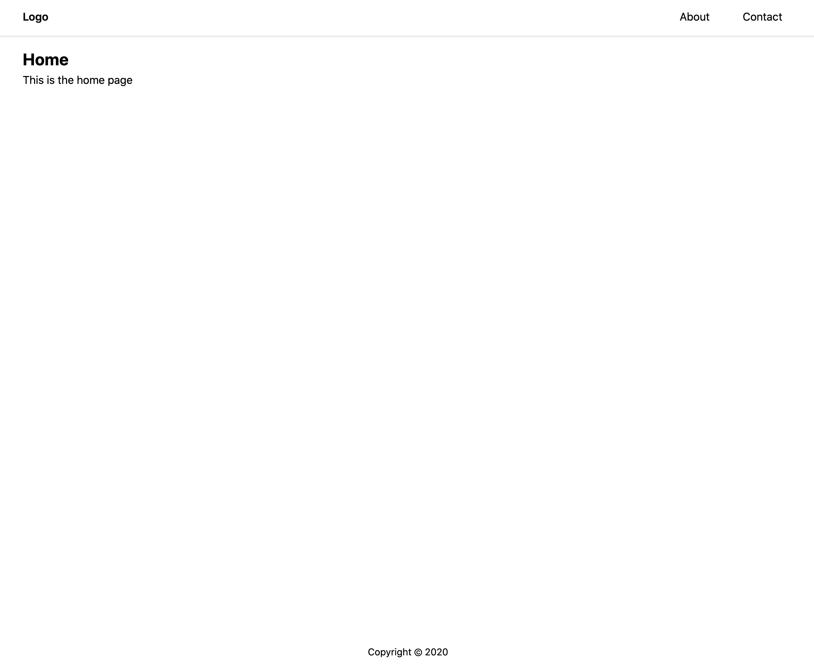

# Simple landing page with ExpressJS, AlpineJS, TailwindCSS and Cypress



This application is built with the following technologies:

- ExpressJS
- Embedded JavaScript templating
- TailwindCSS
- AlpineJS
- Cypress

## Development

For easier development we are using `nodemon` and `reload` so that `nodejs` server restarts when we apply changes and `.ejs` view files reload too. Only thing we need to run is:

```bash
yarn dev
```

or even:

```bash
yarn develop
```

Keep in mind that we are building tailwind css file before expressjs server gets started. The outcome is placed under `dist/app.css`.

## Production

For production setup we need to ensure that tailwind is built too. Please note that for production bundle `cssnano` is used in order to minify them too.

```bash
yarn build
```

## Testing

We are using Cypress for testing. If you want to play with it locally simply run:

```bash
yarn cypress:open
```

